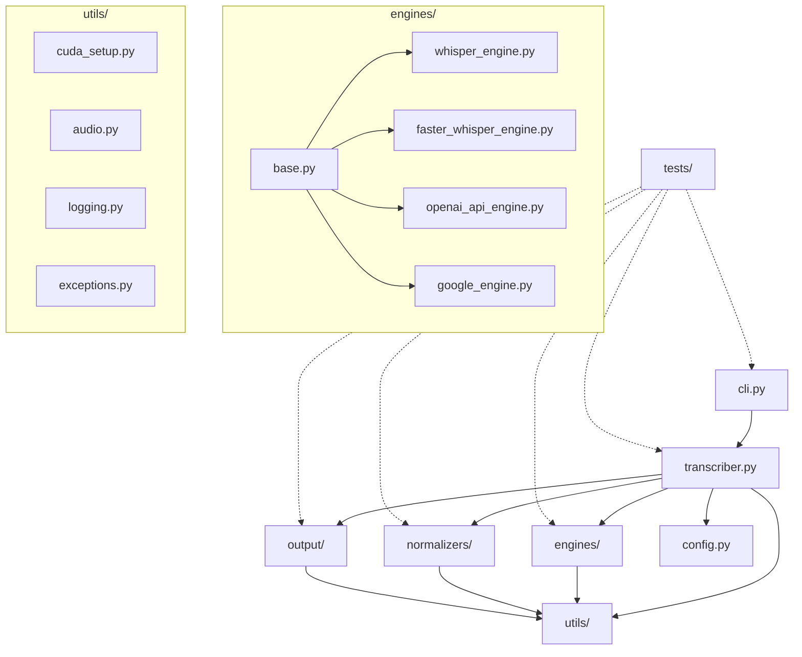

# Architecture Documentation

## Persian Audio Transcriber

**Version:** 2.0.0  
**Last Updated:** December 2025  
**Project:** persian-audio-transcriber

---

## Table of Contents

1. [High-Level Architecture](#1-high-level-architecture)
2. [Project Structure](#2-project-structure)
3. [Module Descriptions](#3-module-descriptions)
4. [Module Dependencies](#4-module-dependencies)
5. [Cross-Platform CUDA Detection](#5-cross-platform-cuda-detection)
6. [Data Flow](#6-data-flow)
7. [Configuration Management](#7-configuration-management)
8. [New CLI and Transcription Manager](#8-new-cli-and-transcription-manager)
9. [Error Handling Strategy](#9-error-handling-strategy)
10. [Extension Points](#10-extension-points)

---

## 1. High-Level Architecture

```
┌─────────────────────────────────────────────────────────────────┐
│                    CLI Entry Point (cli.py)                     │
│  • Argument parsing (argparse)                                  │
│  • Config loading (Config.load())                               │
│  • Logging configuration                                        │
│  • Command routing: transcribe | normalize | check-cuda         │
└──────────────────────┬──────────────────────────────────────────┘
                       │
        ┌──────────────┴──────────────┐
        │                             │
┌───────▼────────┐           ┌────────▼─────────┐
│ Transcriber    │           │ Normalizer       │
│ Manager        │           │ (Persian Text)   │
│                │           │                  │
│ • File         │           │ • Arabic→Persian │
│   discovery    │           │ • Whitespace     │
│ • Parallel     │           │   normalization  │
│   processing   │           │ • Numeral conv.  │
│ • CSV output   │           └──────────────────┘
│ • Progress bar │
└───────┬────────┘
        │
        │ Uses
        ▼
┌────────────────────────────────────────────────┐
│   TranscriptionEngine (Abstract Base Class)    │
│   • transcribe(audio_path) → str               │
│   • transcribe_batch(paths) → List[str]        │
│   • validate_audio_path(path) → Path           │
└────────────────┬───────────────────────────────┘
                 │
     ┌───────────┴────────────┐
     │                        │
┌────▼─────────────────┐  ┌──▼────────────────────────┐
│ Offline Engine       │  │ OpenAI Engine             │
│                      │  │                           │
│ • torchaudio loader  │  │ • API client (openai lib) │
│ • Wav2Vec2 ASR       │  │ • Rate limiting (3 req/s) │
│ • Device management  │  │ • Retry logic (3 attempts)│
│ • CPU/CUDA fallback  │  │ • Exponential backoff     │
└──────────────────────┘  └───────────────────────────┘
```

---

## 1. Project Structure

```
persian-transcriber/
│
├── src/
│   └── persian_transcriber/           # Main package directory
│       ├── __init__.py                 # Package init with __version__
│       ├── __main__.py                 # Entry point for `python -m persian_transcriber`
│       ├── cli.py                      # Command-line interface (argparse)
│       ├── transcriber.py              # Main PersianAudioTranscriber class
│       ├── config.py                   # Configuration dataclasses and defaults
│       │
│       ├── engines/                    # Transcription engine implementations
│       │   ├── __init__.py             # Engine factory and base class exports
│       │   ├── base.py                 # Abstract base class for all engines
│       │   ├── whisper_engine.py       # OpenAI Whisper implementation
│       │   ├── faster_whisper_engine.py # Faster-Whisper (CTranslate2) implementation
│       │   ├── openai_api_engine.py    # OpenAI API (cloud) implementation
│       │   └── google_engine.py        # Google Speech Recognition implementation
│       │
│       ├── normalizers/                # Text normalization modules
│       │   ├── __init__.py             # Normalizer exports
│       │   ├── base.py                 # Abstract normalizer interface
│       │   ├── persian.py              # Persian/Farsi normalizer (Hazm wrapper)
│       │   └── basic.py                # Fallback basic normalizer
│       │
│       ├── output/                     # Output formatters
│       │   ├── __init__.py             # Formatter exports
│       │   ├── base.py                 # Abstract formatter interface
│       │   ├── txt_formatter.py        # Plain text output
│       │   ├── json_formatter.py       # JSON with metadata
│       │   └── srt_formatter.py        # SRT subtitle format
│       │
│       └── utils/                      # Utility modules
│           ├── __init__.py             # Utility exports
│           ├── cuda_setup.py           # Cross-platform CUDA/GPU detection
│           ├── audio.py                # Audio extraction and processing
│           ├── logging.py              # Logging configuration
│           └── exceptions.py           # Custom exception classes
│
├── tests/                              # Test suite
│   ├── __init__.py
│   ├── conftest.py                     # Pytest fixtures and configuration
│   ├── test_transcriber.py             # Transcriber integration tests
│   ├── test_cli.py                     # CLI argument parsing tests
│   │
│   ├── engines/                        # Engine-specific tests
│   │   ├── __init__.py
│   │   ├── test_whisper_engine.py
│   │   ├── test_faster_whisper_engine.py
│   │   └── test_base_engine.py
│   │
│   ├── normalizers/                    # Normalizer tests
│   │   ├── __init__.py
│   │   ├── test_persian_normalizer.py
│   │   └── test_basic_normalizer.py
│   │
│   ├── output/                         # Output formatter tests
│   │   ├── __init__.py
│   │   ├── test_srt_formatter.py
│   │   └── test_json_formatter.py
│   │
│   └── fixtures/                       # Test data files
│       ├── sample_audio.wav            # Short test audio (< 1 second)
│       └── expected_outputs/           # Expected output files for comparison
│
├── docs/                               # Documentation
│   ├── ARCHITECTURE.md                 # This file
│   ├── API.md                          # Python API reference
│   ├── USER_GUIDE.md                   # End-user documentation
│   ├── TROUBLESHOOTING.md              # Common issues and solutions
│   ├── BENCHMARKS.md                   # Performance benchmarks
│   └── CONTRIBUTING.md                 # Contribution guidelines
│
├── examples/                           # Usage examples
│   ├── basic_transcription.py          # Simple single-file transcription
│   ├── batch_processing.py             # Folder batch processing
│   ├── custom_engine.py                # Extending with custom engine
│   └── api_integration.py              # Using as library in other projects
│
├── .github/                            # GitHub configuration
│   ├── workflows/
│   │   ├── ci.yml                      # Continuous integration (tests, lint)
│   │   ├── release.yml                 # Automated releases to PyPI
│   │   └── docs.yml                    # Documentation build/deploy
│   ├── ISSUE_TEMPLATE/
│   │   ├── bug_report.md
│   │   └── feature_request.md
│   └── PULL_REQUEST_TEMPLATE.md
│
├── pyproject.toml                      # Modern Python packaging (PEP 517/518)
├── setup.py                            # Legacy setup (for editable installs)
├── setup.cfg                           # Setup configuration
├── requirements.txt                    # Production dependencies
├── requirements-dev.txt                # Development dependencies
├── requirements-gpu.txt                # Optional GPU dependencies
├── .gitignore                          # Git ignore rules
├── .pre-commit-config.yaml             # Pre-commit hooks configuration
├── MANIFEST.in                         # Package data inclusion rules
├── LICENSE                             # MIT License
├── README.md                           # Project overview
└── CHANGELOG.md                        # Version history
```

---

## 2. Module Descriptions

### 2.1 Core Package (`src/persian_transcriber/`)

| File | Description | Key Contents |
|------|-------------|--------------|
| `__init__.py` | Package entry point; exports public API and `__version__` | `__version__`, `PersianAudioTranscriber`, `TranscriptionResult` |
| `__main__.py` | Enables `python -m persian_transcriber` execution | Imports and calls `cli.main()` |
| `cli.py` | Command-line interface using argparse | `main()`, `parse_args()`, `setup_logging()` |
| `transcriber.py` | Main orchestrator class; delegates to engines/normalizers | `PersianAudioTranscriber`, `TranscriptionResult` dataclass |
| `config.py` | Configuration dataclasses and environment loading | `TranscriberConfig`, `EngineConfig`, `load_config()` |

### 2.2 Engines (`src/persian_transcriber/engines/`)

| File | Description | Key Contents |
|------|-------------|--------------|
| `__init__.py` | Engine factory pattern; exports all engines | `get_engine()`, `EngineType` enum, `BaseEngine` |
| `base.py` | Abstract base class defining engine interface | `BaseEngine` ABC with `transcribe()`, `load_model()`, `unload_model()` |
| `whisper_engine.py` | OpenAI Whisper (original) implementation | `WhisperEngine(BaseEngine)` |
| `faster_whisper_engine.py` | Faster-Whisper with CTranslate2 optimization | `FasterWhisperEngine(BaseEngine)` |
| `openai_api_engine.py` | Cloud-based OpenAI API transcription | `OpenAIAPIEngine(BaseEngine)` |
| `google_engine.py` | Google Speech Recognition via SpeechRecognition lib | `GoogleEngine(BaseEngine)` |

### 2.3 Normalizers (`src/persian_transcriber/normalizers/`)

| File | Description | Key Contents |
|------|-------------|--------------|
| `__init__.py` | Normalizer factory and exports | `get_normalizer()`, `NormalizerType` enum |
| `base.py` | Abstract normalizer interface | `BaseNormalizer` ABC with `normalize()` method |
| `persian.py` | Hazm-based Persian normalizer with Arabic→Persian mapping | `PersianNormalizer(BaseNormalizer)` |
| `basic.py` | Fallback when Hazm unavailable; basic character mapping only | `BasicNormalizer(BaseNormalizer)` |

### 2.4 Output Formatters (`src/persian_transcriber/output/`)

| File | Description | Key Contents |
|------|-------------|--------------|
| `__init__.py` | Formatter factory and exports | `get_formatter()`, `OutputFormat` enum |
| `base.py` | Abstract formatter interface | `BaseFormatter` ABC with `format()`, `save()` |
| `txt_formatter.py` | Plain text output (just the transcription) | `TxtFormatter(BaseFormatter)` |
| `json_formatter.py` | JSON with segments, timestamps, metadata | `JsonFormatter(BaseFormatter)` |
| `srt_formatter.py` | SRT subtitle format with timing | `SrtFormatter(BaseFormatter)` |

### 2.5 Utilities (`src/persian_transcriber/utils/`)

| File | Description | Key Contents |
|------|-------------|--------------|
| `__init__.py` | Utility exports | All utility functions |
| `cuda_setup.py` | Cross-platform GPU detection and PATH setup | `setup_cuda_paths()`, `is_cuda_available()`, `get_device_info()` |
| `audio.py` | Audio extraction from video, format conversion | `extract_audio()`, `convert_to_wav()`, `get_audio_duration()` |
| `logging.py` | Structured logging setup with file/console handlers | `setup_logging()`, `get_logger()` |
| `exceptions.py` | Custom exception hierarchy | `TranscriptionError`, `EngineError`, `AudioProcessingError`, `CUDAError` |

### 2.6 Tests (`tests/`)

| File | Description | Key Contents |
|------|-------------|--------------|
| `conftest.py` | Pytest fixtures shared across tests | `transcriber`, `sample_audio`, `mock_engine` fixtures |
| `test_transcriber.py` | Integration tests for main transcriber | Tests for `transcribe_file()`, `scan_and_transcribe()` |
| `test_cli.py` | CLI argument parsing and execution tests | Tests for all CLI flags and options |

---

## 3. Module Dependencies

### 3.1 Dependency Diagram (ASCII)

```
                                    ┌─────────────────────┐
                                    │     cli.py          │
                                    │  (entry point)      │
                                    └──────────┬──────────┘
                                               │
                                               ▼
┌──────────────┐              ┌─────────────────────────────────┐
│   config.py  │◄─────────────│       transcriber.py            │
│              │              │   (PersianAudioTranscriber)     │
└──────────────┘              └───────┬───────────┬─────────────┘
                                      │           │
                    ┌─────────────────┼───────────┼─────────────────┐
                    │                 │           │                 │
                    ▼                 ▼           ▼                 ▼
          ┌─────────────────┐ ┌──────────────┐ ┌──────────────┐ ┌──────────────┐
          │   engines/      │ │ normalizers/ │ │   output/    │ │    utils/    │
          │                 │ │              │ │              │ │              │
          │ ┌─────────────┐ │ │ ┌──────────┐ │ │ ┌──────────┐ │ │ ┌──────────┐ │
          │ │  base.py    │ │ │ │ base.py  │ │ │ │ base.py  │ │ │ │cuda_setup│ │
          │ └──────┬──────┘ │ │ └────┬─────┘ │ │ └────┬─────┘ │ │ └──────────┘ │
          │        │        │ │      │       │ │      │       │ │ ┌──────────┐ │
          │        ▼        │ │      ▼       │ │      ▼       │ │ │  audio   │ │
          │ ┌─────────────┐ │ │ ┌──────────┐ │ │ ┌──────────┐ │ │ └──────────┘ │
          │ │whisper_eng. │ │ │ │persian.py│ │ │ │txt_fmt.py│ │ │ ┌──────────┐ │
          │ │faster_wh.   │ │ │ │basic.py  │ │ │ │json_fmt. │ │ │ │ logging  │ │
          │ │openai_api.  │ │ │ └──────────┘ │ │ │srt_fmt.  │ │ │ └──────────┘ │
          │ │google_eng.  │ │ │              │ │ └──────────┘ │ │ ┌──────────┐ │
          │ └─────────────┘ │ │              │ │              │ │ │exceptions│ │
          └────────┬────────┘ └──────────────┘ └──────────────┘ │ └──────────┘ │
                   │                                            └──────┬───────┘
                   │                                                   │
                   └───────────────────────────────────────────────────┘
                                 (engines use utils/cuda_setup)


                    ┌───────────────────────────────────────────┐
                    │                 tests/                     │
                    │                                           │
                    │  Imports FROM all src/ modules            │
                    │  NEVER imported BY src/ modules           │
                    └───────────────────────────────────────────┘
```

### 3.2 Import Rules

| Module | Can Import From | Cannot Import From |
|--------|-----------------|-------------------|
| `cli.py` | `transcriber`, `config`, `utils.logging` | Nothing imports cli |
| `transcriber.py` | `engines`, `normalizers`, `output`, `utils`, `config` | `cli` |
| `engines/*` | `utils`, `exceptions` | `transcriber`, `cli`, `normalizers`, `output` |
| `normalizers/*` | `utils.exceptions` | `transcriber`, `cli`, `engines`, `output` |
| `output/*` | `utils.exceptions` | `transcriber`, `cli`, `engines`, `normalizers` |
| `utils/*` | Only standard library + third-party | Any `src/` modules |
| `tests/*` | Everything in `src/` | Nothing imports tests |

### 3.3 Dependency Graph (Mermaid format for GitHub)



---

## 4. Cross-Platform CUDA Detection

### 4.1 Problem Statement

The current implementation hardcodes Windows paths:
```python
# BAD: Windows-only
cuda_install_base = r"C:\Program Files\NVIDIA GPU Computing Toolkit\CUDA"
```

### 4.2 Solution: Platform-Aware CUDA Setup

`utils/cuda_setup.py` should implement cross-platform detection:

```python
"""
Cross-platform CUDA/GPU detection and configuration.

Supports:
- Windows: NVIDIA CUDA Toolkit in Program Files + pip-installed DLLs
- Linux: System CUDA (/usr/local/cuda) + LD_LIBRARY_PATH
- macOS: No CUDA (Apple Silicon uses Metal/MPS instead)
"""

import os
import sys
import platform
from pathlib import Path
from typing import Optional, Dict, List
from dataclasses import dataclass
import logging

logger = logging.getLogger(__name__)


@dataclass
class GPUInfo:
    """GPU device information."""
    available: bool
    device_name: Optional[str] = None
    cuda_version: Optional[str] = None
    compute_capability: Optional[str] = None
    memory_total_mb: Optional[int] = None
    platform: str = platform.system()


def get_platform() -> str:
    """Return normalized platform name."""
    system = platform.system().lower()
    if system == "darwin":
        return "macos"
    return system  # "windows" or "linux"


def _get_cuda_paths_windows() -> List[Path]:
    """Get CUDA library paths on Windows."""
    paths = []
    
    # 1. System CUDA Toolkit installation
    cuda_base = Path(r"C:\Program Files\NVIDIA GPU Computing Toolkit\CUDA")
    if cuda_base.exists():
        # Find highest CUDA 12.x version
        for version_dir in sorted(cuda_base.iterdir(), reverse=True):
            if version_dir.name.startswith("v12"):
                bin_path = version_dir / "bin"
                if bin_path.exists() and (bin_path / "cublas64_12.dll").exists():
                    paths.append(bin_path)
                    break
    
    # 2. Pip-installed NVIDIA packages
    try:
        import site
        site_packages = Path(site.getsitepackages()[0])
        for pkg in ["cublas", "cudnn", "cuda_runtime"]:
            pkg_bin = site_packages / "nvidia" / pkg / "bin"
            if pkg_bin.exists():
                paths.append(pkg_bin)
    except Exception:
        pass
    
    return paths


def _get_cuda_paths_linux() -> List[Path]:
    """Get CUDA library paths on Linux."""
    paths = []
    
    # 1. Standard CUDA installation
    for cuda_path in ["/usr/local/cuda", "/usr/local/cuda-12", "/opt/cuda"]:
        lib_path = Path(cuda_path) / "lib64"
        if lib_path.exists():
            paths.append(lib_path)
            break
    
    # 2. Check LD_LIBRARY_PATH
    ld_path = os.environ.get("LD_LIBRARY_PATH", "")
    for path in ld_path.split(":"):
        if path and "cuda" in path.lower():
            paths.append(Path(path))
    
    return paths


def _get_cuda_paths_macos() -> List[Path]:
    """Get CUDA paths on macOS (usually empty - use MPS instead)."""
    logger.info("macOS detected: CUDA not available, will use MPS for Apple Silicon")
    return []


def setup_cuda_paths() -> bool:
    """
    Configure environment for CUDA libraries.
    
    Returns:
        bool: True if CUDA paths were configured, False otherwise.
    """
    platform_name = get_platform()
    
    path_getters = {
        "windows": _get_cuda_paths_windows,
        "linux": _get_cuda_paths_linux,
        "macos": _get_cuda_paths_macos,
    }
    
    getter = path_getters.get(platform_name)
    if not getter:
        logger.warning(f"Unknown platform: {platform_name}")
        return False
    
    paths = getter()
    
    if not paths:
        logger.info(f"No CUDA paths found on {platform_name}")
        return False
    
    # Add paths to environment
    if platform_name == "windows":
        current_path = os.environ.get("PATH", "")
        new_paths = ";".join(str(p) for p in paths if str(p) not in current_path)
        if new_paths:
            os.environ["PATH"] = new_paths + ";" + current_path
            logger.info(f"Added CUDA paths to PATH: {new_paths}")
    else:  # Linux
        current_ld = os.environ.get("LD_LIBRARY_PATH", "")
        new_paths = ":".join(str(p) for p in paths if str(p) not in current_ld)
        if new_paths:
            os.environ["LD_LIBRARY_PATH"] = new_paths + ":" + current_ld
            logger.info(f"Added CUDA paths to LD_LIBRARY_PATH: {new_paths}")
    
    return True


def is_cuda_available() -> bool:
    """Check if CUDA is available for PyTorch."""
    try:
        import torch
        return torch.cuda.is_available()
    except ImportError:
        return False


def is_mps_available() -> bool:
    """Check if Apple Metal Performance Shaders (MPS) is available."""
    try:
        import torch
        return hasattr(torch.backends, "mps") and torch.backends.mps.is_available()
    except ImportError:
        return False


def get_best_device() -> str:
    """
    Get the best available compute device.
    
    Returns:
        str: "cuda", "mps", or "cpu"
    """
    if is_cuda_available():
        return "cuda"
    if is_mps_available():
        return "mps"
    return "cpu"


def get_device_info() -> GPUInfo:
    """Get detailed GPU information."""
    info = GPUInfo(available=False, platform=get_platform())
    
    try:
        import torch
        
        if torch.cuda.is_available():
            info.available = True
            info.device_name = torch.cuda.get_device_name(0)
            info.cuda_version = torch.version.cuda
            
            # Get compute capability
            props = torch.cuda.get_device_properties(0)
            info.compute_capability = f"{props.major}.{props.minor}"
            info.memory_total_mb = props.total_memory // (1024 * 1024)
            
        elif is_mps_available():
            info.available = True
            info.device_name = "Apple Silicon (MPS)"
            
    except ImportError:
        logger.warning("PyTorch not installed, cannot detect GPU")
    
    return info
```

### 4.3 Platform Behavior Summary

| Platform | GPU Support | Detection Method | Fallback |
|----------|-------------|------------------|----------|
| **Windows** | CUDA (NVIDIA) | PATH + DLL detection | CPU |
| **Linux** | CUDA (NVIDIA) | LD_LIBRARY_PATH + /usr/local/cuda | CPU |
| **macOS (Intel)** | Limited CUDA | N/A | CPU |
| **macOS (Apple Silicon)** | MPS (Metal) | torch.backends.mps | CPU |

### 4.4 Usage in Engines

```python
# In faster_whisper_engine.py
from ..utils.cuda_setup import setup_cuda_paths, get_best_device, get_device_info

class FasterWhisperEngine(BaseEngine):
    def __init__(self, model_size: str = "medium"):
        # Setup CUDA paths before importing faster_whisper
        setup_cuda_paths()
        
        from faster_whisper import WhisperModel
        
        device = get_best_device()
        compute_type = "float16" if device == "cuda" else "int8"
        
        self.model = WhisperModel(model_size, device=device, compute_type=compute_type)
        
        info = get_device_info()
        if info.available:
            logger.info(f"Using {info.device_name} ({device})")
        else:
            logger.info("Using CPU (no GPU detected)")
```

---

## 5. Data Flow

### 5.1 Transcription Flow

```
┌─────────────┐     ┌─────────────┐     ┌─────────────┐     ┌─────────────┐
│   INPUT     │     │   ENGINE    │     │ NORMALIZER  │     │   OUTPUT    │
│             │     │             │     │             │     │             │
│ audio.mp3   │────▶│  Whisper/   │────▶│  Persian/   │────▶│  txt/json/  │
│ video.mp4   │     │  Faster-W   │     │  Basic      │     │  srt        │
└─────────────┘     └─────────────┘     └─────────────┘     └─────────────┘
      │                   │                   │                   │
      │                   │                   │                   │
      ▼                   ▼                   ▼                   ▼
┌─────────────┐     ┌─────────────┐     ┌─────────────┐     ┌─────────────┐
│ utils/audio │     │TransResult  │     │ Normalized  │     │ Formatted   │
│ extract()   │     │ (raw text,  │     │ text with   │     │ output file │
│             │     │  segments)  │     │ Persian fix │     │             │
└─────────────┘     └─────────────┘     └─────────────┘     └─────────────┘
```

### 5.2 Class Interaction Sequence

```
User                CLI                 Transcriber          Engine            Normalizer
  │                  │                      │                   │                   │
  │ python -m ...    │                      │                   │                   │
  │─────────────────▶│                      │                   │                   │
  │                  │ parse_args()         │                   │                   │
  │                  │─────────────────────▶│                   │                   │
  │                  │                      │ get_engine()      │                   │
  │                  │                      │──────────────────▶│                   │
  │                  │                      │                   │ load_model()      │
  │                  │                      │                   │───────────────────│
  │                  │                      │                   │                   │
  │                  │                      │ transcribe_file() │                   │
  │                  │                      │──────────────────▶│                   │
  │                  │                      │                   │ transcribe()      │
  │                  │                      │                   │───────────────────│
  │                  │                      │◀──────────────────│ raw_result        │
  │                  │                      │                   │                   │
  │                  │                      │ normalize()       │                   │
  │                  │                      │───────────────────────────────────────▶│
  │                  │                      │◀───────────────────────────────────────│
  │                  │                      │                   │  normalized_text  │
  │                  │◀─────────────────────│                   │                   │
  │◀─────────────────│ TranscriptionResult  │                   │                   │
  │                  │                      │                   │                   │
```

---

## 6. Configuration Management

### 6.1 Configuration Hierarchy

```
Priority (highest to lowest):
1. Command-line arguments      (--model large-v3)
2. Environment variables       (TRANSCRIBER_MODEL=large-v3)
3. Config file                 (config.yaml or config.json)
4. Default values              (defined in config.py)
```

### 6.2 Config Dataclass Example

```python
# config.py
from dataclasses import dataclass, field
from typing import Optional, Literal
from pathlib import Path
import os
import json


@dataclass
class EngineConfig:
    """Engine-specific configuration."""
    type: Literal["whisper", "faster_whisper", "openai_api", "google"] = "faster_whisper"
    model_size: str = "medium"
    device: Optional[str] = None  # auto-detect if None
    compute_type: str = "float16"


@dataclass
class NormalizerConfig:
    """Text normalization configuration."""
    enabled: bool = True
    type: Literal["persian", "basic", "none"] = "persian"


@dataclass
class OutputConfig:
    """Output configuration."""
    format: Literal["txt", "json", "srt"] = "txt"
    directory: Optional[Path] = None


@dataclass
class TranscriberConfig:
    """Main application configuration."""
    language: str = "fa"
    engine: EngineConfig = field(default_factory=EngineConfig)
    normalizer: NormalizerConfig = field(default_factory=NormalizerConfig)
    output: OutputConfig = field(default_factory=OutputConfig)
    
    # API keys (from environment)
    openai_api_key: Optional[str] = field(
        default_factory=lambda: os.environ.get("OPENAI_API_KEY")
    )
    
    @classmethod
    def from_file(cls, path: Path) -> "TranscriberConfig":
        """Load configuration from JSON or YAML file."""
        with open(path) as f:
            if path.suffix == ".json":
                data = json.load(f)
            else:
                import yaml
                data = yaml.safe_load(f)
        return cls(**data)
```

---

## 7. Package Entry Points

### 7.1 `__init__.py` (Public API)

```python
"""
Persian Audio/Video Transcription Tool.

GPU-accelerated transcription with Persian/Farsi language support.
"""

from .transcriber import PersianAudioTranscriber, TranscriptionResult
from .config import TranscriberConfig

__version__ = "2.0.0"
__author__ = "Dark Oracle"

__all__ = [
    "PersianAudioTranscriber",
    "TranscriptionResult", 
    "TranscriberConfig",
    "__version__",
]
```

### 7.2 `__main__.py` (CLI Entry)

```python
"""Enable execution via `python -m persian_transcriber`."""

from .cli import main

if __name__ == "__main__":
    main()
```

### 7.3 `pyproject.toml` Entry Points

```toml
[project.scripts]
persian-transcribe = "persian_transcriber.cli:main"
ptranscribe = "persian_transcriber.cli:main"  # Short alias
```

---

## 8. New CLI and Transcription Manager

### 8.1 CLI Entry Point (`src/cli.py`)

**Purpose:** Main command-line interface for the refactored toolkit

**Key Features:**
- Subcommands: `transcribe`, `normalize`, `check-cuda`
- Config loading with YAML support
- Logging configuration
- Engine selection and initialization

**Command Examples:**
```bash
# Transcribe audio files
python -m src transcribe --folder ./audio --output results.csv --engine openai

# Normalize Persian text
python -m src normalize --text "سلام دنيا"

# Check CUDA availability
python -m src check-cuda
```

### 8.2 Transcription Manager (`src/transcriber.py`)

**Purpose:** Orchestrate batch transcription with parallel processing

**Key Features:**
- File discovery with configurable extensions
- ThreadPoolExecutor for parallel transcription
- tqdm progress bars
- Batched CSV writes for memory efficiency
- Per-file error handling and recovery

**Data Flow:**
```
Input Folder
    ↓
find_audio_files() → List[Path]
    ↓
ThreadPoolExecutor.submit() × max_workers
    ↓
engine.transcribe() for each file
    ↓
Collect results with tqdm progress
    ↓
Write CSV in batches (batch_size=10)
    ↓
Output CSV: file_path, status, transcript, error_msg
```

### 8.3 New Engines

#### Offline Engine (`src/engines/offline.py`)
- Uses torchaudio Wav2Vec2 ASR bundle
- Auto device selection (CUDA if available, else CPU)
- Audio resampling and mono conversion
- On-demand model loading

#### OpenAI Engine (`src/engines/openai.py`)
- Rate limiting: max 3 requests/second
- Retry logic: 3 attempts with exponential backoff
- API key validation at initialization
- Handles RateLimitError, AuthenticationError, APIError

---

## 9. Error Handling Strategy

### Engine-Level Errors

**Offline Engine:**
- `FileNotFoundError`: Audio file missing → propagate
- `RuntimeError`: torch/torchaudio not installed → raise with install hint
- Model loading failures → log, fallback to CPU if CUDA fails

**OpenAI Engine:**
- `ValueError`: Missing API key → raise at init
- `AuthenticationError`: Invalid key → propagate immediately
- `RateLimitError`: Quota exceeded → retry with backoff (up to 3 attempts)
- `APIError`: Transient error → retry with backoff

### Manager-Level Errors

**TranscriptionManager:**
- `FileNotFoundError`: Folder missing → raise immediately
- Per-file failures → catch, log, store in result dict, continue
- CSV write failures → raise `OSError`, abort batch

### CLI-Level Errors

**Exit Codes:**
- `0`: Success
- `1`: Configuration/engine/transcription error
- `130`: User interrupt (KeyboardInterrupt)

---

## 10. Extension Points

### Adding a New Engine

1. Create `src/engines/my_engine.py`
2. Subclass `TranscriptionEngine`
3. Implement `transcribe(audio_path: str) → str`
4. Update `src/engines/__init__.py`:
   ```python
   from .my_engine import MyEngine
   __all__.append("MyEngine")
   ```
5. Add CLI support in `src/cli.py`

### Adding New Output Formats

Extend `TranscriptionManager`:
```python
def _write_json_batch(self, output_path: Path) -> None:
    with output_path.open("a", encoding="utf-8") as f:
        for result in self.results:
            json.dump(result, f)
            f.write("\n")
```

### Custom Normalizers

Subclass `BasicPersianNormalizer`:
```python
class CustomNormalizer(BasicPersianNormalizer):
    def normalize(self, text: str) -> str:
        text = super().normalize(text)
        # Add custom logic
        return text
```

---

## 11. Migration Checklist

Converting from single `main.py` to package structure:

- [x] Create directory structure (`src/engines`, `src/utils`)
- [x] Extract normalizer logic → `src/utils/normalizer.py`
- [x] Extract CUDA setup → `src/utils/cuda_setup.py`
- [x] Create abstract engine base → `src/engines/base.py`
- [x] Implement offline engine → `src/engines/offline.py`
- [x] Implement OpenAI engine → `src/engines/openai.py`
- [x] Create transcription manager → `src/transcriber.py`
- [x] Create CLI entry point → `src/cli.py`
- [x] Create `__main__.py` for module execution
- [x] Write unit tests for engines
- [x] Update CI workflow with setuptools/wheel
- [ ] Update documentation (README, USER_GUIDE, API)
- [ ] Create example configurations

---

## 12. Appendix: File Templates

### 9.1 Base Engine Template

```python
# engines/base.py
from abc import ABC, abstractmethod
from dataclasses import dataclass
from typing import List, Optional


@dataclass
class Segment:
    """A transcription segment with timing."""
    text: str
    start: float
    end: float
    confidence: Optional[float] = None


@dataclass  
class EngineResult:
    """Raw result from transcription engine."""
    text: str
    segments: List[Segment]
    language: str
    duration: float


class BaseEngine(ABC):
    """Abstract base class for transcription engines."""
    
    @abstractmethod
    def load_model(self) -> None:
        """Load the transcription model into memory."""
        pass
    
    @abstractmethod
    def unload_model(self) -> None:
        """Unload model to free memory."""
        pass
    
    @abstractmethod
    def transcribe(self, audio_path: str, language: str = "fa") -> EngineResult:
        """
        Transcribe audio file.
        
        Args:
            audio_path: Path to audio file
            language: Language code (default: Persian/Farsi)
            
        Returns:
            EngineResult with transcription data
        """
        pass
    
    @property
    @abstractmethod
    def name(self) -> str:
        """Engine display name."""
        pass
    
    @property
    def is_loaded(self) -> bool:
        """Check if model is loaded."""
        return hasattr(self, "model") and self.model is not None
```

---

*Document generated for persian-transcriber v2.0.0*
